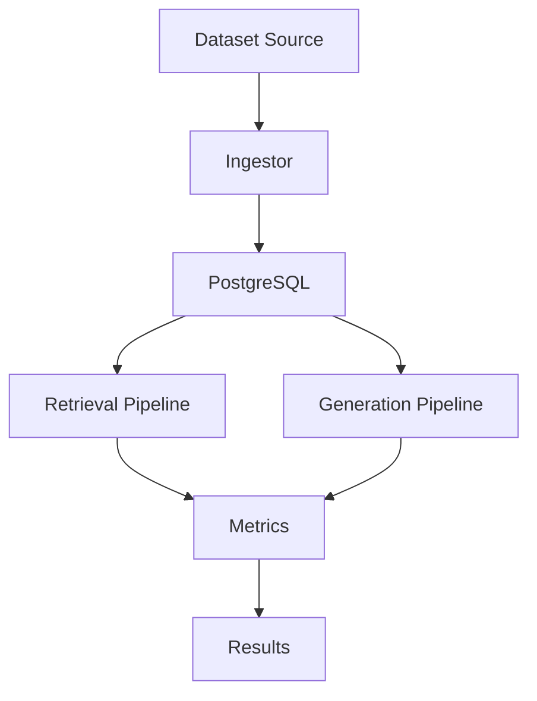

# Architecture

## System Overview



## Data Flow

1. **Ingest**: Load dataset into PostgreSQL
2. **Embed**: Generate vector embeddings
3. **Execute**: Run pipelines on all queries
4. **Evaluate**: Calculate metrics
5. **Store**: Save results to database

## Layered Architecture

```
Executor/Evaluator (config.py, executor.py, evaluator.py)
    |
Pipeline Layer (pipelines/)
    |
Service Layer (orm/service/) - Business logic
    |
Unit of Work (orm/uow/) - Transaction management
    |
Repository Layer (orm/repository/) - Data access
    |
ORM Models (orm/models/) - SQLAlchemy with pgvector
```

## Extension Points

| Extend | Base Class | Methods |
|--------|------------|---------|
| Retrieval | `BaseRetrievalPipeline` | `_get_retrieval_func()` |
| Generation | `BaseGenerationPipeline` | `_generate()` |
| Metric | `BaseMetricConfig` | `get_metric_func()` |
| Dataset | `DataIngestor` | `ingest()` |

## Key Components

### PostgreSQL with Vector Extensions

- **pgvector**: Vector similarity search
- **VectorChord-BM25**: Full-text BM25 retrieval
- Supports both dense (embedding) and sparse (keyword) retrieval

### Configuration System

- YAML-based experiment configuration
- Hydra for config composition
- Dataclass-based pipeline and metric configs
